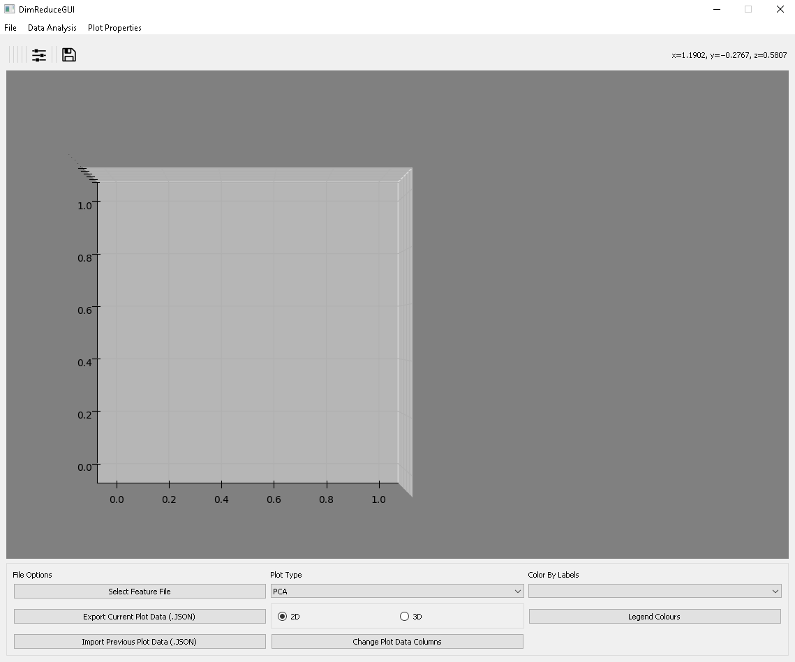

## <ins>DimReduceGUI </ins>

DimReduceGUI offers different options for plotting and visualizing datasets.
>1. Performs dimensionality reduction to reduce dataset features to 2D or 3D plot (PCA, t-SNE, Sammon, UMAP)
>2. Colors data points according to class labels
>3. Interactive system to display images corresponding to data points

 

</img>

 

### <ins>Menubar </ins>
 >* File >> Select Feature File: Upload data file and select dataset columns
 >* Data Analysis >> Clustering
 >  * Estimate Clusters: Uses AP Clustering to estimate optimum number of cluster
 >    Note: For large datasets may take a few minutes
 >  * Set Number of Clusters: Choose number of clusters for analysis
 >  * Cluster Pie Maps (2D): Display cluster centers and class label distribution of plot ("Set Number of Clusters" prior to using)
 >  * Export Cluster Results: Create textfile containing original data and index of cluster center that data belongs to (Cluster Assignment)

### <ins>Plot Options </ins>

#### <ins>File Options</ins>

* Select Feature File: Upload data file and select dataset columns
    #### <ins>Select Feature File -> Column Selection </ins>
  * Select Columns from dataset to plot/visualize
      
     

     </img>

      
     
    

    </img>

     
>
  >* Image Filename Column: Useable if the dataset has a column with the filenames of your images. 
  >  * Use the "Add Path" button to specify the image folder/directory if not included in your dataset. Press Select Filename Columns to select and see available columns  (Note: if empty, then was unable to find valid paths/directories) 
  >* Labels Column Selection: Select Columns with class labels to label/colour your data points. Press Select Labels/groups to select and see available columns.  
  >* Current Plot Data Selection: Select Columns to plot. Press Select Plot Data Columns to select and see available columns (Note: Only numerical columns will be available)  
  >* Dimension Reductionality Plot Analysis: To plot Raw Data, checkmark "Optional Checkbox" and use x, y, z axis dropdown to select data columns 
  >  * Note: use Select Plot Data Columns prior to using. Must select options for at least 2 axes) 

 
#### <ins>Select Feature File-> Column Selection -> Select ... Columns Button </ins>
 * Selected Columns GUI 
    
   

   </img>

    

>Selecting columns
>1. Method #1:  
>Click desired columns from "Available Columns to Add" list one at a time (will turn green if selected)
>2. Method #2:  
>   * Checkmark Manually Edit Select Columns. 
>   * Press Select All. 
>   * Highlight and delete undesired columns from Column Textbox.  

>   >Press OK to confirm
 

</img>

 

#### <ins>Export/Import Plot Data </ins>
 > * Export Current Plot Data: export plot data coordinates as .json file
 > * Import Previous Plot Data: import data coordinates from .json file created by "Export Current Plot Data". 
  Note: Data file from previous session must be in same location 

#### <ins>Plot Type</ins>
> * plot analysis options: PCA, t-SNE, Sammon, UMAP, Raw Data (must be set in "Select Feature File" or "Change Plot Data Columns" to be available)
> * 2D or 3D plot analysis
> * Change Plot Data Columns: Change selected data columns (Column Selection - Feature File will pop-up)

#### <ins>Color by Labels</ins> 
 >* Select class labels for data point colours (must be set in "Select Feature File" or "Change Plot Data Columns" to be available)
 >* Legend Colours: Change class label colours (only available if legend exists. Not available for colorbar)
  Note: If over 50 unique class labels, will default to colorbar

#### <ins>Imageviewer </ins>
 

</img>

 

> * Right-Click on Data point to show associated image
>  Note: Image Filename Column must be selected during "Select Featurefile" or "Change Plot Data Columns" to be available

### <ins>Clustering Data</ins>
 

</img>

 

>- Automated Cluster Estimation: Click Data Analysis >> Clustering >> Estimate Clusters
>- Based on AP Clustering returns optimum number of clusters (Estimated Optimal Cluster --  )
>- Note: For large dataset takes a few minutes

 

</img>
 

> - Set Clusters: Click Data Analysis >> Clustering >> Set Number of Clusters
> - Enter number of clusters then Press OK to confirm. Click Close when finished.

 

</img>

 

> - Pie Charts: Click Data Analysis >> Clustering >> Pie Maps (Only available after clustering)
> - Shows cluster center locations, data points belonging to cluster, and class labels percentage as pie chart
> - Note: Colours are based on "Color by Labels" dropdown class labels and Legend Colours. Numbered labels can be dragged to different location.

- Export: Click Data Analysis >> Clustering >> Export Clustering Results (Only available
after clustering)

### <ins>Plot Rotation</ins>

There are options available to enable/disable rotation of the scatter plot. If enabled, use the left-click and drag to rotate the plot (If 3D Plot Type then rotation is automatically enabled).
Reset plot view will return rotation to default xy-plane view as seen below. 

 

</img>

 

